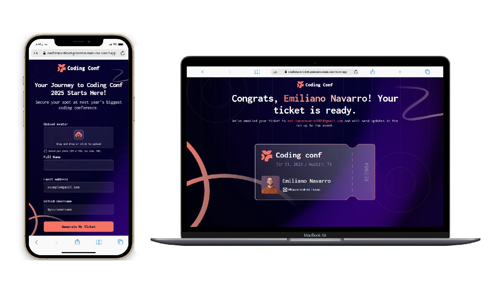

# Frontend Mentor - Conference ticket generator solution

This is a solution to the [Conference ticket generator challenge on Frontend Mentor](https://www.frontendmentor.io/challenges/conference-ticket-generator-oq5gFIU12w). Frontend Mentor challenges help you improve your coding skills by building realistic projects. 

## Table of contents

- [Overview](#overview)
  - [Screenshot](#screenshot)
  - [Links](#links)
- [My process](#my-process)
  - [Built with](#built-with)
- [Author](#author)

### Screenshot

### Links

- Solution URL: https://github.com/NavarroEmiliano/conference-ticket-generator-main
- Live Site URL: https://conference-ticket-generator-main-one.vercel.app/

### Built with

- CSS custom properties
- Flexbox
- Mobile-first workflow
- [React](https://reactjs.org/) - JS library
- [TypeScript](https://www.typescriptlang.org/) - React framework

## Author

- Website - [Emiliano Navarro](https://emiliano-navarro.vercel.app/)
- Frontend Mentor - [@NavarroEmiliano](https://www.frontendmentor.io/profile/NavarroEmiliano)
